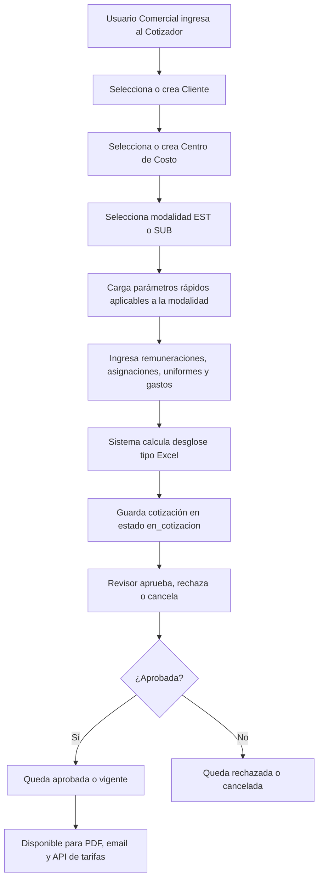
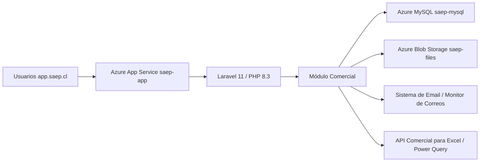

# Módulo Comercial SAEP - Documentación Gerencial y Operativa

> **Versión:** 15-06-2026
> **Ambiente productivo:** `https://app.saep.cl`
> **Aplicación Azure:** `saep-app`
> **Resource Group:** `saep-rg`
> **Repositorio operativo:** `brayanmachero/saep-platform` / rama `main`
> **Repositorio local de trabajo:** `C:\Users\BrayanMachero\Saep-App`

---

## 1. Resumen Ejecutivo

El módulo Comercial centraliza el proceso de cotización comercial de SAEP para servicios **EST** y **SUB**, permitiendo mantener parámetros de cálculo, crear cotizaciones, aprobarlas, versionarlas, generar PDF, enviar cotizaciones por email y exponer tarifas aprobadas mediante API para consumo externo, por ejemplo desde Excel con Power Query.

El objetivo operacional es reducir dependencia de planillas manuales, dejar trazabilidad de cambios y publicar valores comerciales vigentes de forma controlada.

### Capacidades Principales

| Capacidad | Descripción |
| --- | --- |
| Cotizador EST/SUB | Calcula sueldo base, haberes, cotizaciones, provisiones, gastos, margen, precio venta y horas extra. |
| Creación rápida | Permite crear cliente y centro de costo desde el flujo de cotización. |
| Mantenedor editable | Parámetros de gobierno, tasas, fórmulas, márgenes y uniformes se pueden administrar desde interfaz. |
| Auditoría | Registra cambios de parámetros y eventos de cotización, incluyendo usuario, fecha, valores e IP. |
| PDF comercial | Genera documento formal de cotización con desglose financiero. |
| Email controlado | Envía cotización con PDF adjunto y queda registrado en Monitor de Correos. |
| API de tarifas | Entrega cotizaciones aprobadas o vigentes para integraciones externas. |

---

## 2. Flujo Funcional del Proceso Comercial



### Estados de Cotización

| Estado | Uso |
| --- | --- |
| `en_cotizacion` | Cotización creada y editable. |
| `aprobada` | Cotización validada comercialmente. |
| `vigente` | Cotización aprobada marcada como tarifa vigente. |
| `rechazada` | Cotización revisada y no aceptada. |
| `cancelada` | Cotización anulada por decisión operativa. |

---

## 3. Arquitectura Técnica

El módulo está construido dentro de una aplicación **Laravel 11** con patrón modular. La aplicación corre sobre **Azure App Service Linux con PHP 8.3**, usa **MySQL 8.0 Flexible Server** como base de datos principal y **Azure Blob Storage** para archivos públicos.



### Stack Tecnológico

| Capa | Tecnología |
| --- | --- |
| Backend | Laravel 11, PHP 8.3 |
| Frontend | Blade, Vite, Tailwind/CSS del proyecto, JavaScript |
| Base de datos | MySQL 8.0 en Azure Flexible Server |
| Archivos | Azure Blob Storage mediante `league/flysystem-azure-blob-storage` |
| PDF | `barryvdh/laravel-dompdf` |
| Excel/reportes | `phpoffice/phpspreadsheet` |
| Deploy | GitHub Actions + Azure Web Apps Deploy |
| Hosting | Azure App Service Linux |

---

## 4. Alojamiento, Repositorios y Despliegue

### Producción

| Elemento | Valor |
| --- | --- |
| URL pública | `https://app.saep.cl` |
| Azure App Service | `saep-app` |
| Slot | `Production` |
| Resource Group | `saep-rg` |
| Región | Chile Central |
| Ruta de código en servidor | `/home/site/wwwroot` |
| Web root | `/home/site/wwwroot/public` |
| Configuración nginx | `nginx.conf` del repo copiado a `/etc/nginx/sites-available/default` |

### Recursos Azure Relacionados

| Recurso | Nombre / dato |
| --- | --- |
| App Service | `saep-app` |
| MySQL Flexible Server | `saep-mysql.mysql.database.azure.com` |
| Storage Account | `saepplatformstorage` |
| Blob container | `saep-files` |
| URL Blob base | `https://saepplatformstorage.blob.core.windows.net/saep-files` |

### Repositorios

| Remoto | Uso |
| --- | --- |
| `origin` | `https://github.com/brayanmachero/Saep-App.git` |
| `prod` | `https://github.com/brayanmachero/saep-platform.git` |

El despliegue automático se ejecuta cuando se hace push a la rama `main` del repositorio conectado a Azure.

### Pipeline CI/CD

Archivo principal:

```text
.github/workflows/main_saep-app.yml
```

Secuencia actual del pipeline:

1. Checkout del código.
2. Configura PHP 8.3 con extensiones requeridas.
3. Configura Node.js 20.
4. Instala dependencias PHP con Composer en modo producción.
5. Instala dependencias NPM.
6. Compila assets con `npm run build`.
7. Remueve `node_modules` antes del deploy.
8. Autentica contra Azure mediante GitHub Secrets.
9. Despliega a Azure Web App `saep-app`.
10. Reinicia el App Service.

Secretos usados por GitHub Actions:

```text
AZUREAPPSERVICE_CLIENTID_F725ECA705F4413E9F96D4C3A9A1FE31
AZUREAPPSERVICE_TENANTID_5C9F6BFA340F4D4FA2A5BC01741E1AA0
AZUREAPPSERVICE_SUBSCRIPTIONID_2785B06199884B4DA346A4F35FBEB92B
```

> Nota de seguridad: este documento registra nombres de secretos y variables, no sus valores.

---

## 5. Script de Arranque en Azure

Archivo:

```text
startup.sh
```

Dónde se ejecuta:

```text
/home/site/wwwroot/startup.sh
```

Cuándo se ejecuta:

- Al iniciar o reiniciar el App Service.
- Después del deploy, cuando el workflow reinicia `saep-app`.

Responsabilidades del script:

| Acción | Detalle |
| --- | --- |
| Dependencia PDF | Intenta instalar Ghostscript. |
| ImageMagick | Habilita lectura/escritura PDF si existe policy local. |
| Uploads | Define `upload_max_filesize=50M` y `post_max_size=64M`. |
| Nginx | Copia `nginx.conf` del repo al servidor. |
| Google | Reconstruye `google-credentials.json` desde `GOOGLE_CREDENTIALS_BASE64`. |
| Laravel storage | Ejecuta `php artisan storage:link --force`. |
| Caches | Limpia y reconstruye config, rutas y vistas. |
| Base de datos | Ejecuta `php artisan migrate --force`. |
| Comercial | Ejecuta `ComercialSeeder` para asegurar parámetros base. |

Comandos ejecutados para Laravel:

```bash
php artisan storage:link --force
php artisan optimize:clear
php artisan view:clear
php artisan config:clear
php artisan route:clear
php artisan cache:clear
php artisan config:cache
php artisan route:cache
php artisan view:cache
php artisan migrate --force
php artisan db:seed --class=App\\Modules\\Comercial\\database\\seeders\\ComercialSeeder --force
```

---

## 6. Ubicación del Código del Módulo

### Registro del módulo

El módulo se registra en:

```text
bootstrap/providers.php
```

Proveedor:

```text
App\Modules\Comercial\ComercialServiceProvider
```

Responsabilidades del proveedor:

- Cargar configuración desde `app/Modules/Comercial/config/comercial.php`.
- Cargar migraciones desde `app/Modules/Comercial/database/migrations`.
- Cargar rutas desde `app/Modules/Comercial/routes/web.php`.
- Cargar vistas desde `resources/views/comercial` y fallback del módulo.

### Estructura principal

```text
app/Modules/Comercial/
├─ ComercialServiceProvider.php
├─ config/comercial.php
├─ routes/web.php
├─ Http/Controllers/
├─ Models/
├─ Services/
├─ database/migrations/
└─ database/seeders/
```

### Controladores

| Archivo | Responsabilidad |
| --- | --- |
| `CotizacionController.php` | CRUD de cotizaciones, aprobación, vigencia, rechazo, PDF, email e historial. |
| `ClienteController.php` | Clientes comerciales y creación/importación rápida. |
| `CentroCostoController.php` | Centros de costo comerciales. |
| `ParametroController.php` | Mantenedor de parámetros, auditoría, batch update y uniformes dinámicos. |
| `ReporteController.php` | Reportes y exportación. |
| `TarifaApiController.php` | API externa de clientes y tarifas aprobadas/vigentes. |

### Servicios

| Archivo | Responsabilidad |
| --- | --- |
| `CalculadoraCotizacionService.php` | Orquesta cálculo y persistencia del detalle. |
| `CalculadoraESTService.php` | Fórmulas de modalidad EST. |
| `CalculadoraSUBService.php` | Fórmulas de modalidad SUB, incluyendo HHEE dinámica. |
| `GeneradorPDFService.php` | Generación y descarga de PDF comercial. |
| `IntegradorGobiernoService.php` | Actualización de UF, IPC y sueldo mínimo desde fuentes configuradas. |

### Vistas

| Ruta | Uso |
| --- | --- |
| `resources/views/comercial/cotizador/` | Crear, editar, listar, ver detalle e histórico de cotizaciones. |
| `resources/views/comercial/mantenedor/parametros.blade.php` | Mantenedor comercial. |
| `resources/views/comercial/reportes/cotizacion-pdf.blade.php` | Template del PDF. |
| `resources/views/comercial/clientes/` | Pantallas de clientes. |
| `resources/views/comercial/centros-costo/` | Pantallas de centros de costo. |
| `resources/views/emails/comercial_cotizacion.blade.php` | Template de email de cotización. |

---

## 7. Rutas Web del Módulo

Todas las rutas web del módulo están protegidas por:

```text
auth
consentimiento
force.password
modulo:comercial
```

Prefijo:

```text
/comercial
```

### Cotizador

| Método | Ruta | Uso |
| --- | --- | --- |
| GET | `/comercial/cotizaciones` | Listar cotizaciones. |
| GET | `/comercial/cotizaciones/create` | Nueva cotización. |
| POST | `/comercial/cotizaciones` | Guardar cotización. |
| POST | `/comercial/cotizaciones/previsualizar` | Calcular preview sin guardar. |
| GET | `/comercial/cotizaciones/{cotizacion}` | Ver detalle. |
| GET | `/comercial/cotizaciones/{cotizacion}/edit` | Editar cotización. |
| PUT/PATCH | `/comercial/cotizaciones/{cotizacion}` | Actualizar cotización. |
| DELETE | `/comercial/cotizaciones/{cotizacion}` | Eliminar cotización. |
| PATCH | `/comercial/cotizaciones/{cotizacion}/aprobar` | Aprobar. |
| PATCH | `/comercial/cotizaciones/{cotizacion}/hacer-vigente` | Marcar vigente. |
| PATCH | `/comercial/cotizaciones/{cotizacion}/rechazar` | Rechazar. |
| PATCH | `/comercial/cotizaciones/{cotizacion}/cancelar` | Cancelar. |
| GET | `/comercial/cotizaciones/{cotizacion}/historico` | Ver histórico/versiones. |
| POST | `/comercial/cotizaciones/{cotizacion}/enviar-email` | Enviar cotización por correo. |
| GET | `/comercial/cotizaciones/{cotizacion}/pdf` | Descargar PDF. |

### Clientes y Centros

| Método | Ruta | Uso |
| --- | --- | --- |
| GET | `/comercial/clientes` | Listar clientes. |
| POST | `/comercial/clientes` | Crear cliente. |
| POST | `/comercial/clientes/importar` | Importar clientes. |
| GET | `/comercial/centros-costo` | Listar centros de costo. |
| POST | `/comercial/centros-costo` | Crear centro de costo. |

### Mantenedor

| Método | Ruta | Uso |
| --- | --- | --- |
| GET | `/comercial/mantenedor/parametros` | Ver mantenedor comercial. |
| PATCH | `/comercial/mantenedor/parametros` | Actualizar un parámetro. |
| POST | `/comercial/mantenedor/parametros/batch-update` | Guardar cambios masivos y uniformes nuevos. |
| POST | `/comercial/mantenedor/parametros/actualizar-gobierno` | Actualizar datos de gobierno. |

### Reportes

| Método | Ruta | Uso |
| --- | --- | --- |
| GET | `/comercial/reportes/cotizaciones` | Reporte de cotizaciones. |
| GET | `/comercial/reportes/clientes` | Reporte de clientes. |
| POST | `/comercial/reportes/export-excel` | Exportación Excel. |

---

## 8. API Comercial para Excel, Power Query o Sistemas Externos

La API está pensada para entregar tarifas aprobadas o vigentes a sistemas externos sin abrir acceso completo a la plataforma.

Prefijo:

```text
/comercial/api
```

Protección:

- Token API.
- Rate limit: `120` requests por minuto.
- No usa sesión de navegador ni CSRF.

### Endpoints

| Método | Ruta | Descripción |
| --- | --- | --- |
| GET | `/comercial/api/clientes` | Lista clientes activos. |
| GET | `/comercial/api/tarifas-cotizadas` | Entrega tarifas aprobadas/vigentes por cliente. |

### Autenticación API

Formas soportadas:

```http
Authorization: Bearer <TOKEN>
```

o:

```http
X-SAEP-API-KEY: <TOKEN>
```

También existe soporte por query string (`api_key` o `token`) solo si `COMERCIAL_API_ALLOW_QUERY_TOKEN=true`. Para producción se recomienda mantenerlo en `false` y usar headers.

### Variables y almacenamiento del token

| Fuente | Uso |
| --- | --- |
| `COMERCIAL_API_TOKEN` | Token desde App Settings / env. |
| Tabla `configuraciones`, clave `comercial_api_token` | Fallback de token desde base de datos. |
| `COMERCIAL_API_ENABLED` | Habilita/deshabilita API. |
| `COMERCIAL_API_ALLOW_QUERY_TOKEN` | Permite token en URL si es estrictamente necesario. |

### Filtros de tarifas

La consulta de tarifas exige al menos uno:

| Filtro | Ejemplo |
| --- | --- |
| `cliente_id` | `cliente_id=1` |
| `rut` | `rut=76xxxxxx-x` |
| `cliente` | `cliente=Cliente Ejemplo` |

Filtros opcionales:

| Filtro | Uso |
| --- | --- |
| `modalidad` | `EST` o `SUB`. |
| `centro_costo_id` | Filtra por centro de costo. |
| `estado` o `estados` | `vigente`, `aprobada` o `vigente,aprobada`. |
| `limit` | Máximo de registros, hasta 2000. |
| `format=csv` | Respuesta CSV con separador `;`. |

### Ejemplos de URLs

```text
https://app.saep.cl/comercial/api/clientes?q=cliente
https://app.saep.cl/comercial/api/tarifas-cotizadas?cliente_id=1
https://app.saep.cl/comercial/api/tarifas-cotizadas?rut=76xxxxxx-x&modalidad=EST
https://app.saep.cl/comercial/api/tarifas-cotizadas?cliente=Cliente%20Ejemplo&estado=vigente,aprobada&format=csv
```

### Uso sugerido en Power Query

```powerquery
let
    Source = Json.Document(
        Web.Contents(
            "https://app.saep.cl",
            [
                RelativePath = "comercial/api/tarifas-cotizadas",
                Query = [
                    cliente = "Cliente Ejemplo",
                    estado = "vigente,aprobada"
                ],
                Headers = [
                    Authorization = "Bearer TU_TOKEN_API"
                ]
            ]
        )
    ),
    Data = Source[data],
    Tabla = Table.FromRecords(Data)
in
    Tabla
```

---

## 9. Base de Datos y Almacenamiento

### Base de datos principal

| Elemento | Valor |
| --- | --- |
| Motor | MySQL 8.0 |
| Servicio | Azure MySQL Flexible Server |
| Host | `saep-mysql.mysql.database.azure.com` |
| Conexión Laravel | `DB_CONNECTION=mysql` |

Variables principales:

```text
DB_CONNECTION
DB_HOST
DB_PORT
DB_DATABASE
DB_USERNAME
DB_PASSWORD
```

### Tablas del módulo Comercial

| Tabla | Modelo | Uso |
| --- | --- | --- |
| `comercial_clientes` | `Cliente` | Clientes comerciales simplificados. |
| `comercial_centros_costo` | `CentroCosto` | Centros de costo comerciales. |
| `comercial_modalidades` | `Modalidad` | Modalidades EST/SUB. |
| `comercial_parametros` | `Parametro` | Parámetros de cálculo, gobierno, tasas, uniformes y márgenes. |
| `comercial_parametro_auditorias` | `ParametroAuditoria` | Bitácora de cambios de parámetros. |
| `comercial_cotizaciones` | `Cotizacion` | Cabecera, totales, estado, versión y datos de cálculo. |
| `comercial_cotizacion_detalles` | `CotizacionDetalle` | Líneas de remuneraciones, asignaciones y costos. |
| `comercial_cotizacion_uniformes` | `CotizacionUniforme` | Uniformes/equipos asociados a una cotización. |
| `comercial_cotizacion_auditorias` | `CotizacionAuditoria` | Eventos de cotización. |

### Configuraciones globales relacionadas

La tabla general `configuraciones` se usa para:

- Token API comercial: `comercial_api_token`.
- Interruptor global de correos: `notificaciones_email`.
- Switches por tipo de correo: `mail_auto_<Mailable>_enabled`.

### Archivos y PDF

La aplicación usa `Storage` de Laravel. En producción el disco `public` apunta a Azure Blob Storage:

```text
AZURE_STORAGE_NAME
AZURE_STORAGE_KEY
AZURE_STORAGE_CONTAINER
AZURE_STORAGE_URL
```

El PDF comercial se genera desde:

```text
resources/views/comercial/reportes/cotizacion-pdf.blade.php
```

Servicio responsable:

```text
app/Modules/Comercial/Services/GeneradorPDFService.php
```

---

## 10. Mantenedor Comercial y Auditoría

Ruta funcional:

```text
https://app.saep.cl/comercial/mantenedor/parametros
```

El mantenedor administra:

| Categoría | Ejemplos |
| --- | --- |
| Gobierno | IPC, sueldo mínimo legal, UF. |
| Márgenes | Margen EST, margen SUB. |
| Tasas EST | Mutual, REFPREV, seguro cesantía, SIS. |
| Tasas SUB | Mutual, REFPREV, seguro cesantía, SIS. |
| Fórmulas | Impuesto único, imposiciones, gratificación, gastos administración. |
| Horas | Horas mensuales, jornada semanal SUB, horas HHEE EST. |
| Uniformes | Casco, pantalón, polar y nuevos ítems creados por usuario. |

Cada cambio de parámetro:

- Normaliza formato numérico.
- Valida tipo: moneda, porcentaje, entero o decimal.
- Incrementa versión.
- Guarda valor anterior y nuevo.
- Registra usuario, origen, IP y User-Agent en `comercial_parametro_auditorias`.

Archivo responsable:

```text
app/Modules/Comercial/Http/Controllers/ParametroController.php
```

Modelo:

```text
app/Modules/Comercial/Models/Parametro.php
```

---

## 11. Cálculos Comerciales

El cálculo busca replicar el Excel de referencia, pero con lógica centralizada y trazable.

### Conceptos calculados

| Grupo | Conceptos |
| --- | --- |
| Haberes | Sueldo base, bonos, gratificación, total imponible, total no imponible, total haberes. |
| Descuentos | Imposiciones, alcance líquido, renta tributable, impuesto único. |
| Seguros y cotizaciones | REFPREV, SIS, Mutual, seguro cesantía. |
| Provisiones | Vacaciones, indemnizaciones. |
| Costos | Uniformes, casino, seguros, otros gastos, aguinaldos, gastos administración. |
| Precio | Costo bruto, margen, precio venta. |
| Horas | Hora normal, hora normal HHEE, HHEE 50%, HHEE 100%. |

### HHEE SUB dinámica

La hora normal HHEE SUB se calcula con base legal configurable por jornada semanal:

```text
Factor = 7 / (30 * jornada_semanal)
Hora normal HHEE = sueldo base * factor
Hora extra 50% = hora normal HHEE * 1,5
Hora extra 100% = hora normal HHEE * 2
```

Parámetro asociado:

```text
JORNADA_SEMANAL_SUB
```

Ubicación lógica:

```text
app/Modules/Comercial/Services/CalculadoraSUBService.php
```

---

## 12. Correos, Monitor y Automatizaciones

### Ruta del monitor

```text
https://app.saep.cl/mail-logs
```

Protección:

```text
modulo:configuracion
```

### Email Comercial

| Elemento | Valor |
| --- | --- |
| Template | `resources/views/emails/comercial_cotizacion.blade.php` |
| Llave de automatización | `ComercialCotizacionMail` |
| Envío | Manual desde detalle de cotización. |
| Adjunto | PDF generado en el momento del envío. |
| Registro | Tabla de mail logs. |

Controlador:

```text
app/Modules/Comercial/Http/Controllers/CotizacionController.php
```

Servicio de automatización:

```text
app/Services/MailAutomationService.php
```

El Monitor de Correos permite:

- Ver enviados, fallidos y bloqueados.
- Filtrar por estado, tipo de mail, fechas y búsqueda.
- Activar/desactivar envío global.
- Activar/desactivar cada automatización de email.
- Limpiar registros antiguos.

Variables de correo:

```text
MAIL_MAILER
MAIL_HOST
MAIL_PORT
MAIL_USERNAME
MAIL_PASSWORD
MAIL_FROM_ADDRESS
MAIL_FROM_NAME
COMERCIAL_EMAIL_FROM
COMERCIAL_EMAIL_FROM_NAME
```

---

## 13. Accesos y Seguridad

### Acceso funcional

El usuario debe:

1. Estar autenticado.
2. Tener consentimiento y contraseña vigente según reglas de plataforma.
3. Tener acceso al módulo `comercial`.
4. Tener permisos específicos para crear, editar, eliminar o aprobar cuando aplique.

Permisos relevantes:

| Permiso / middleware | Uso |
| --- | --- |
| `modulo:comercial` | Acceso base al módulo. |
| `puede_crear` | Crear cotizaciones, clientes o centros. |
| `puede_editar` | Editar cotizaciones y parámetros. |
| `puede_eliminar` | Eliminar registros permitidos. |
| `permission:puede_aprobar` | Aprobar, rechazar, cancelar o hacer vigente. |

### Acceso técnico

| Lugar | Uso |
| --- | --- |
| Azure Portal | Configuración de App Service, App Settings, logs y reinicio. |
| Kudu / SSH | Consola Linux para validar código y ejecutar comandos Artisan. |
| GitHub Actions | Ver historial de deploys. |
| Base de datos MySQL | Consulta de tablas y auditorías. |
| Monitor de Correos | Ver estado de emails y automatizaciones. |

Ruta operativa en servidor:

```bash
cd /home/site/wwwroot
```

> Todo dato sensible debe vivir en Azure App Settings, GitHub Secrets o base de datos protegida. No se debe documentar el valor de contraseñas, tokens o keys en archivos del repositorio.

---

## 14. Variables de Entorno Relevantes

### Aplicación y base

```text
APP_ENV
APP_KEY
APP_URL
APP_DEBUG
DB_CONNECTION
DB_HOST
DB_PORT
DB_DATABASE
DB_USERNAME
DB_PASSWORD
SESSION_DRIVER
CACHE_STORE
QUEUE_CONNECTION
```

### Comercial

```text
COMERCIAL_API_ENABLED
COMERCIAL_API_TOKEN
COMERCIAL_API_ALLOW_QUERY_TOKEN
COMERCIAL_MINDICADOR_ENABLED
COMERCIAL_EMAIL_FROM
COMERCIAL_EMAIL_FROM_NAME
BCCH_API_USER
BCCH_API_PASS
BCCH_UF_SERIES
SUELDO_MINIMO_API_URL
```

### Storage

```text
AZURE_STORAGE_NAME
AZURE_STORAGE_KEY
AZURE_STORAGE_CONTAINER
AZURE_STORAGE_URL
FILESYSTEM_DISK
```

### Google / integraciones existentes

```text
GOOGLE_CREDENTIALS_BASE64
GOOGLE_CLIENT_ID
GOOGLE_CLIENT_SECRET
GOOGLE_DRIVE_CREDENTIALS_PATH
GOOGLE_DRIVE_FOLDER_ID
```

### Email

```text
MAIL_MAILER
MAIL_HOST
MAIL_PORT
MAIL_USERNAME
MAIL_PASSWORD
MAIL_FROM_ADDRESS
MAIL_FROM_NAME
RESEND_API_KEY
MSGRAPH_CLIENT_ID
MSGRAPH_CLIENT_SECRET
MSGRAPH_TENANT_ID
```

---

## 15. Comandos de Revisión en Producción

Desde Azure Portal:

```text
App Service saep-app → Development Tools → SSH
```

Luego:

```bash
cd /home/site/wwwroot
```

### Validar rutas comerciales

```bash
php artisan route:list --path=comercial
```

### Validar migraciones

```bash
php artisan migrate:status --path=app/Modules/Comercial/database/migrations
```

### Limpiar cache manualmente

```bash
php artisan optimize:clear
php artisan config:cache
php artisan route:cache
php artisan view:cache
```

### Reejecutar seeder comercial

```bash
php artisan db:seed --class=App\\Modules\\Comercial\\database\\seeders\\ComercialSeeder --force
```

### Probar API sin exponer token

Sin token debe responder `401`:

```bash
curl -i https://app.saep.cl/comercial/api/tarifas-cotizadas
```

Con token:

```bash
curl -H "Authorization: Bearer <TOKEN>" \
  "https://app.saep.cl/comercial/api/tarifas-cotizadas?cliente=Cliente%20Ejemplo"
```

---

## 16. Dónde Visualizar Cada Componente

| Necesidad | Ruta / lugar |
| --- | --- |
| Cotizador | `https://app.saep.cl/comercial/cotizaciones` |
| Nueva cotización | `https://app.saep.cl/comercial/cotizaciones/create` |
| Clientes comerciales | `https://app.saep.cl/comercial/clientes` |
| Centros comerciales | `https://app.saep.cl/comercial/centros-costo` |
| Mantenedor comercial | `https://app.saep.cl/comercial/mantenedor/parametros` |
| Reportes comerciales | `https://app.saep.cl/comercial/reportes/cotizaciones` |
| Monitor de correos | `https://app.saep.cl/mail-logs` |
| GitHub Actions | GitHub → Actions → `Build and deploy PHP app to Azure Web App - saep-app` |
| Azure logs | Azure Portal → App Service `saep-app` → Log stream |
| SSH/Kudu | Azure Portal → App Service `saep-app` → SSH / Advanced Tools |
| Código servidor | `/home/site/wwwroot` |

---

## 17. Checklist para Exposición Gerencial

### Demostración recomendada

1. Mostrar menú Comercial activo.
2. Abrir Cotizador y crear una cotización con cliente/centro existente.
3. Crear cliente o centro rápido desde el cotizador.
4. Cambiar modalidad EST/SUB y mostrar parámetros rápidos filtrados.
5. Ingresar sueldo, bonos, asignaciones y uniformes.
6. Mostrar desglose de cálculo tipo Excel.
7. Guardar cotización.
8. Abrir detalle y mostrar PDF.
9. Aprobar o rechazar según escenario.
10. Enviar email y revisar Monitor de Correos.
11. Consumir API de tarifas aprobadas desde navegador, Postman o Power Query.

### Mensaje clave

El módulo convierte una planilla crítica en un flujo empresarial trazable: reglas centralizadas, auditoría por usuario, aprobación formal, PDF comercial y disponibilidad de tarifas aprobadas para prefacturación o análisis externo.

---

## 18. Riesgos y Cuidados Operativos

| Riesgo | Control recomendado |
| --- | --- |
| Parámetro mal ingresado | Auditoría + versionado + formato visual + permisos de edición. |
| Token API expuesto | Usar headers, no query string, y rotar token si se comparte. |
| Email mal configurado | Validar Monitor de Correos y App Settings SMTP/Graph/Resend. |
| Deploy incompleto | Revisar GitHub Actions y Log stream de Azure. |
| Cache de rutas/config antigua | Ejecutar `php artisan optimize:clear` y recachear. |
| Cambio de sueldo mínimo/UF | Actualizar desde mantenedor o fuente configurada y revisar auditoría. |
| Dependencias locales desalineadas | Reinstalar Composer localmente antes de pruebas locales; producción recompila en CI/CD. |

---

## 19. Archivos Críticos para Mantenimiento

| Archivo | Motivo |
| --- | --- |
| `.github/workflows/main_saep-app.yml` | Pipeline de deploy a Azure. |
| `startup.sh` | Script de arranque, migraciones, cache y seed comercial. |
| `nginx.conf` | Web root y routing hacia Laravel. |
| `bootstrap/providers.php` | Registro del módulo Comercial. |
| `app/Modules/Comercial/routes/web.php` | Rutas web y API del módulo. |
| `app/Modules/Comercial/config/comercial.php` | Configuración de API, PDF, email, gobierno y reglas base. |
| `app/Modules/Comercial/database/seeders/ComercialSeeder.php` | Parámetros iniciales y defaults. |
| `app/Modules/Comercial/Services/CalculadoraESTService.php` | Cálculo EST. |
| `app/Modules/Comercial/Services/CalculadoraSUBService.php` | Cálculo SUB. |
| `resources/views/comercial/cotizador/create.blade.php` | Formulario principal de cotización. |
| `resources/views/comercial/mantenedor/parametros.blade.php` | UI del mantenedor. |
| `resources/views/comercial/reportes/cotizacion-pdf.blade.php` | Template PDF. |
| `resources/views/emails/comercial_cotizacion.blade.php` | Template email comercial. |

---

## 20. Estado Actual y Observaciones

- El módulo Comercial está desplegado en producción bajo `https://app.saep.cl/comercial`.
- La API comercial responde con `401` si no se envía token, comportamiento esperado.
- El deploy productivo se realiza por GitHub Actions al hacer push a `main`.
- Azure ejecuta `startup.sh` después del reinicio para migrar, cachear y asegurar parámetros base.
- No se deben guardar claves ni tokens en esta documentación.
